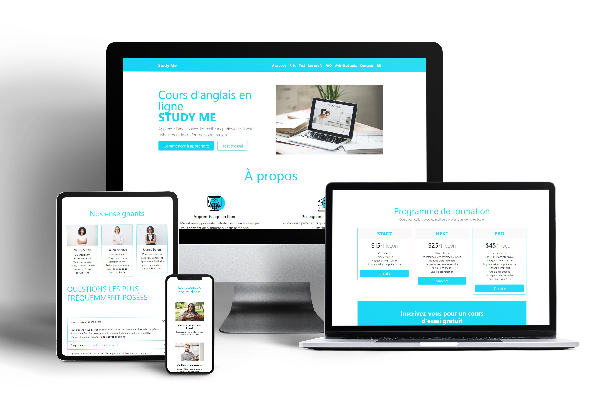

# Study Me - landing page



View Demo <a href="" target="_blank">Study Me</a> 

## 🦉 Main information

A one page site about an English language school Study Me in 2 languages - french and russian.\
This project was built with Bootstrap5.\
Official source https://getbootstrap.com/

## ⚡ Setup

Install Bootstrap in your html file 

```
<link href="https://cdn.jsdelivr.net/npm/bootstrap@5.0.2/dist/css/bootstrap.min.css" rel="stylesheet" integrity="sha384-EVSTQN3/azprG1Anm3QDgpJLIm9Nao0Yz1ztcQTwFspd3yD65VohhpuuCOmLASjC" crossorigin="anonymous">
<script src="https://cdn.jsdelivr.net/npm/bootstrap@5.0.2/dist/js/bootstrap.bundle.min.js" integrity="sha384-MrcW6ZMFYlzcLA8Nl+NtUVF0sA7MsXsP1UyJoMp4YLEuNSfAP+JcXn/tWtIaxVXM" crossorigin="anonymous"></script>
```

Install Bootstrap in Node.js

```
npm install bootstrap
```

